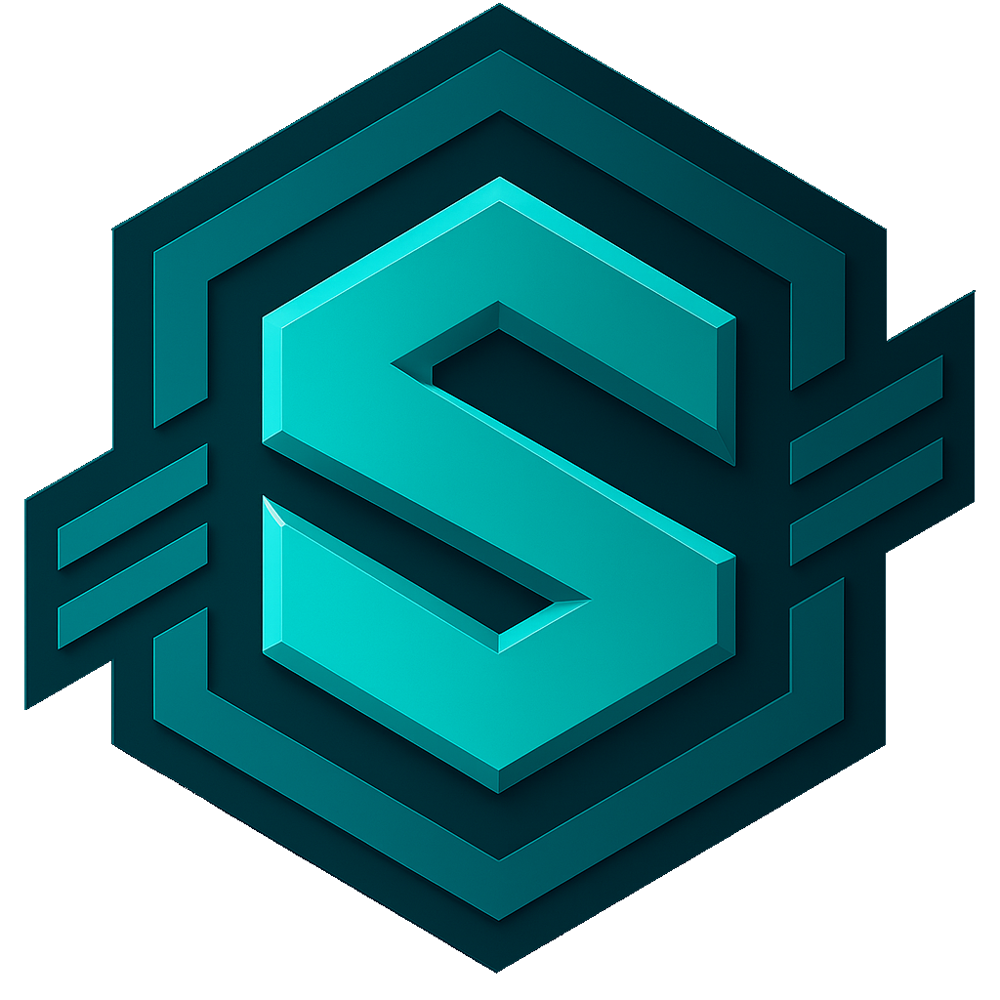
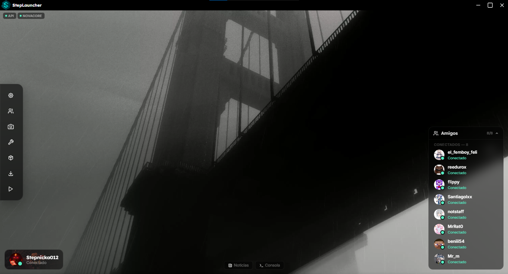
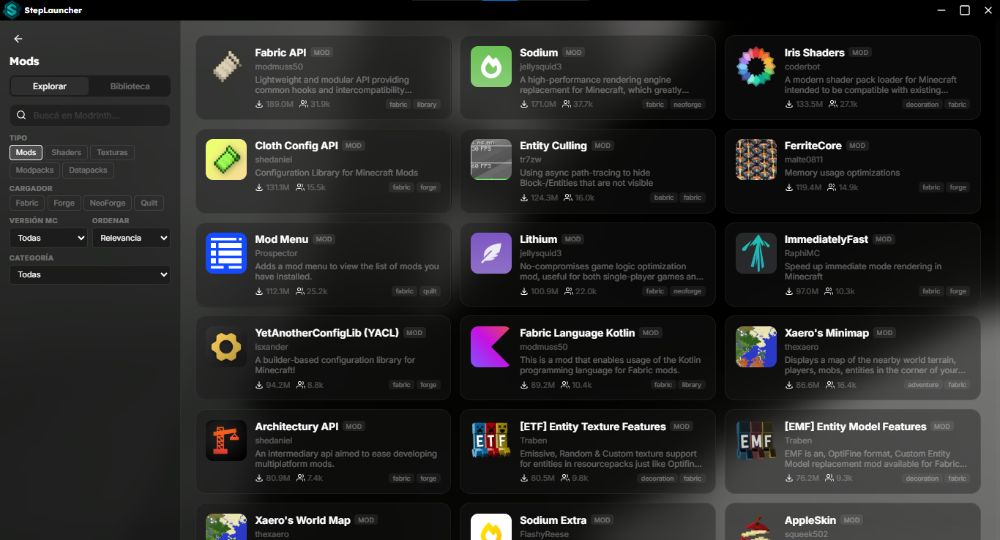
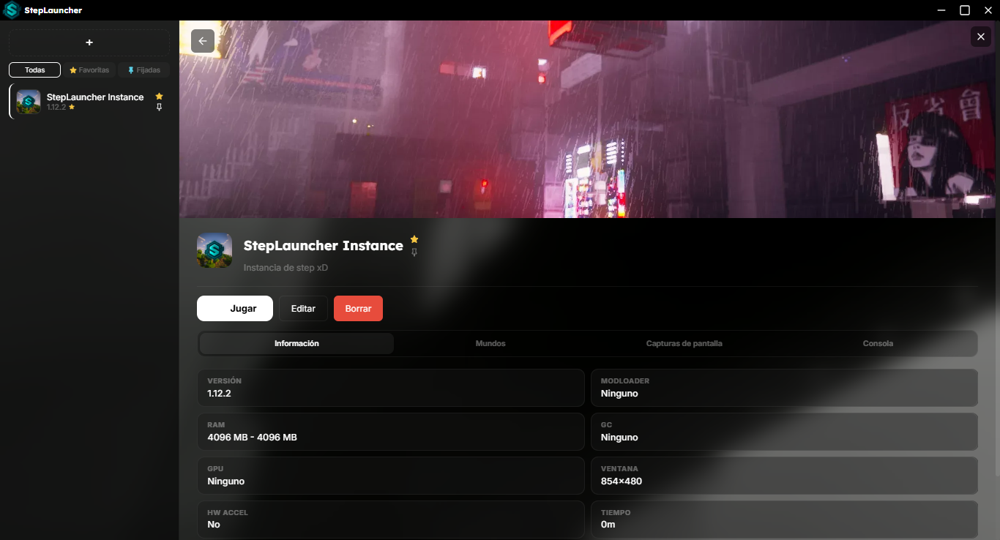
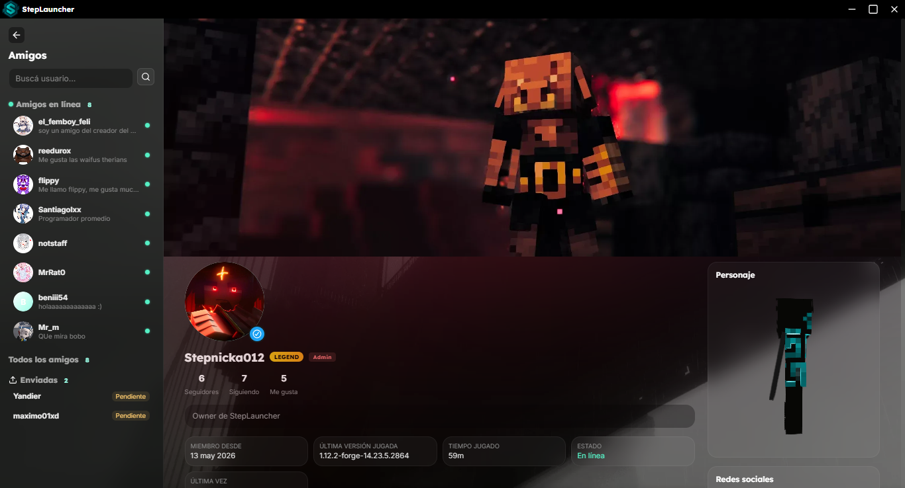

<div align="center">
  <picture>
    <source media="(prefers-color-scheme: dark)" srcset="./assets/icon.png">
    
  </picture>

  <h1 align="center">StepLauncher</h1>

  <p align="center">
    <em>El Mejor Launcher para Minecraft: Java Edition — Premium y No Premium</em><br>
    Rápido, moderno, multiplataforma y completamente open-source.
  </p>

  <p align="center">
    <a href="https://github.com/NovaStepStudio/StepLauncher/releases">
      
    </a>
    <a href="./LICENSE">
      
    </a>
    <a href="https://steplauncher.pages.dev">
      
    </a>
    <a href="https://discord.gg/37dYy9apwE">
      
    </a>
  </p>
</div>

---

## 🚀 ¿Qué es StepLauncher?

**StepLauncher** es un launcher custom de **Minecraft: Java Edition** construido con tecnologías modernas. No es solo otro launcher: es un **ecosistema abierto** diseñado para ser rápido, modular y transparente.

Soporta cuentas **premium** (Mojang autenticado) y **no-premium** (offline), potenciado por **NovaCore-Engine** — un motor Java propio con API HTTP + WebSocket que maneja la instalación de versiones, mod loaders y el lanzamiento del juego con tracking de progreso en tiempo real.

> **Hecho por [Santiago Stepnicka](https://github.com/Stepnicka012)** — Desarrollador Fullstack TypeScript, creador de [NovaStepStudio](https://github.com/NovaStepStudio).

---

## ✨ Funcionalidades

### 🔐 Autenticación & Cuentas
| Característica | Descripción |
|---|---|
| **Online Login** | Usuario y contraseña via API propia con JWT + refresh tokens |
| **OAuth 2.0** | Flujo PKCE completo para autorización segura |
| **Offline Mode** | Perfiles no-premium sin autenticación |
| **Multi-sesión** | Cambio instantáneo entre cuentas premium y no-premium |
| **Persistencia** | Token seguro guardado entre sesiones |

### 👤 Perfiles & Social
- **Perfil completo** con avatar, skin, capa y banner de fondo
- **Estadísticas:** seguidores, siguiendo, likes, tiempo jugado
- **Sistema de amigos:** lista, solicitudes entrantes/salientes, perfiles públicos
- **Presencia en tiempo real** — mirá qué está jugando tu squad
- **Librerías digitales:** colecciones públicas/privadas de mods, resource packs, worlds y más
- **Sistema de cosméticos:** skins, capas y kits subibles con activación en caliente

### 📦 Gestión de Versiones & Instancias
- **Manifest completo de Mojang** — todas las versiones: releases, snapshots, old_alpha, old_beta
- **Descarga optimizada** con barra de progreso y eventos en tiempo real
- **Soporte de mod loaders:** Fabric, Forge, NeoForge, Quilt, LegacyFabric, OptiFine
- **Sistema de instancias:** perfiles independientes con su propia versión, mods y configuraciones
- Directorio runtime compartido para almacenamiento eficiente

### 🎮 Lanzamiento del Juego
- **Argumentos JVM customizables** con presets de GC (G1GC Optimizado, ZGC, Shenandoah)
- **Selección de GPU** (auto, dedicada, integrada)
- **Asignación de RAM** (mínimo/máximo)
- **Configuración de ventana** (resolución, pantalla completa)
- **Authlib-injector** para servidores de autenticación personalizados
- **Quick play** — lanzá directo a singleplayer, multiplayer o realms
- **Auto-hide** del launcher al iniciar el juego con re-show al cerrarlo
- **Verificación pre-lanzamiento** de componentes faltantes

### 🧩 Mods, Modpacks & Contenido
- Descarga de mods desde URL directa
- Instalación de **modpacks Modrinth (`.mrpack`)** con resolución automática de dependencias
- Instalación de **resource packs, shader packs y data packs**
- Gestión de mundos guardados con capturas de pantalla
- Integración directa con múltiples fuentes de contenido

### 🎨 Personalización Visual
- **Interfaz 100% customizable:** color de acento, barra de título, fondo de pantalla
- **Tipografía:** Lexend (headings) + Inter (body)
- **Posición de sidebar** (izquierda/derecha)
- **Toggles:** blur, filtros, sombras, aceleración por hardware
- **Sistema de temas completo:** exportá tu configuración como tema, importá temas de carpetas, galería de preview con imágenes
- **Modo oscuro + Glassmorphism** en toda la interfaz
- **Discord Rich Presence** — mostrá qué estás haciendo en el launcher

### 🌍 Internacionalización
- **8 idiomas soportados:** 🇦🇷 es-AR, 🇺🇸 en-US, 🇪🇸 es-ES, 🇲🇽 es-MX, 🇫🇷 fr-FR, 🇧🇷 pt-BR, 🇷🇺 ru-RU, 🇩🇪 de-DE
- Auto-detección del idioma del navegador
- Interfaz completamente traducida con metadata de calidad

### 🛠️ Consola de Desarrollador
- Logs en tiempo real del juego (stdout/stderr con niveles)
- Historial de crashes con vista expandible y resaltado de código
- Forwarding de logs del motor NovaCore
- Vista de sistema: OS, arquitectura, CPU, RAM, Java, GPU

### ⚡ Motor NovaCore
- **NovaCore-Engine:** motor Java propio con API HTTP + WebSocket
- Instalación secuencial con eventos de progreso en tiempo real
- Gestión de ciclo de vida de instancias
- Descarga automática de **Java 25 JDK**, NovaCore JAR y authlib-injector en primer inicio
- Comunicación bidireccional para logs y estado del juego

---

## 📸 Capturas

<p align="center">
  
  
  <br>
  
  
</p>

---

## 📊 Estadisticas
<p align="center">
  
</p>

---

## 📦 Instalación

### Usuarios
Descargá la última versión desde la [página de releases](https://github.com/NovaStepStudio/StepLauncher/releases) o desde la [web oficial](https://steplauncher.pages.dev/Download):

| Plataforma | Arquitectura | Archivo |
|---|---|---|
| **Windows** | x64 (64-bit) | `StepLauncher-v1.31.0-x64-win.zip` |
| **Windows** | ia32 (32-bit) | `StepLauncher-v1.31.0-ia32-win.zip` |
| **Linux** | x64 | `StepLauncher-v1.31.0-x64-linux.zip` |

Descomprimí y ejecutá `StepLauncher.exe` (Windows) o `steplauncher` (Linux). Todos los archivos están verificados y libres de malware.

### Requisitos del Sistema
- **SO:** Windows 10+ / Linux (kernel 5.x+)
- **RAM:** 2 GB mínimos (4 GB recomendados para Minecraft moderno)
- **Java:** 25+ (se descarga automáticamente si no está presente)
- **Conexión a internet** (para descargar versiones y contenido)
- **GPU:** Cualquier GPU con soporte OpenGL 3.2+ (dedicada recomendada)

---

## 🛠️ Desarrollo

### Prerrequisitos
- **Node.js** >=20.19 o >=22.12
- **npm** 10+
- **Git** (con `--recursive` para submódulos)

### Clonar e instalar
```bash
git clone --recursive https://github.com/NovaStepStudio/StepLauncher.git
cd StepLauncher
npm install
```

### Modo desarrollo (hot-reload)
```bash
# Terminal 1: Servidor Vite con HMR
npm run dev

# Terminal 2: Electron apuntando al dev server
npm start
```

### Build producción
```bash
# 1. Compilar Vue + TypeScript (renderer)
npm run build

# 2. Compilar Electron (main process)
npm run compile:electron

# 3. Empaquetar para distribución
npm run dist:win     # Windows (x64 + ia32)
npm run dist:linux   # Linux (x64)
npm run dist:all     # Ambos
```

### Formatear código
```bash
npm run format      # oxfmt sobre renderer/src/
```

---

## 🏗️ Estructura del Proyecto

```
StepLauncher/
│
├── electron/                      # Electron main process (TypeScript)
│   ├── App.ts                     # Entry point: window, tray, deep-link, IPC registers
│   ├── Preload.ts                 # contextBridge API
│   ├── Core/                      # NovaCore engine client (HTTP + WebSocket)
│   ├── IPC/                       # 9 módulos IPC
│   ├── Services/                  # REST API client, Discord RPC, Logger, Download Manager
│   ├── Stores/                    # Persistencia: Auth, Config, Themes
│   ├── Types/                     # Interfaces compartidas
│   └── Utils/                     # Utilidades (PKCE)
│
├── renderer/                      # Frontend (Vite root)
│   ├── index.html                 # HTML entry + splash screen
│   ├── assets/                    # Fonts, icons SVG, locales, backgrounds
│   └── src/
│       ├── main.ts                # App entry, i18n init
│       ├── App.vue                # Root component
│       ├── Components/            # UI components
│       ├── Composables/           # Vue composables
│       ├── Layouts/               # Layout components
│       ├── Modals/                # DownloadModal, LaunchModal
│       ├── Panels/                # 8 panels
│       ├── Widgets/               # UI widgets
│       ├── Styles/                # SCSS styles
│       ├── i18n/                  # i18n setup
│       └── Types/                 # Type definitions
│
├── NovaCore-Engine/               # Java Minecraft engine (submodule)
├── assets/                        # Iconos e imágenes del launcher
├── Themes/                        # Temas
└── docs/                          # Documentación
```

---

## 🤝 Ecosistema NovaStepStudio

StepLauncher es parte de un ecosistema más grande de herramientas open-source creadas por [NovaStepStudio](https://github.com/NovaStepStudio):

| Proyecto | Descripción | Tech |
|---|---|---|
| **[NovaCore-Engine](https://github.com/NovaStepStudio/NovaCore-Engine)** | Motor Java para launchers de Minecraft | Java |
| **[Minecraft-Core-Master](https://github.com/NovaStepStudio/Minecraft-Core-Master)** | Librería TypeScript: descarga, instalación y lanzamiento de Minecraft | TypeScript |
| **[COptifine](https://github.com/NovaStepStudio/COptifine)** | Módulo C++ para manifest y descarga de OptiFine | C++ |
| **[PyOptifine](https://github.com/NovaStepStudio/PyOptifine)** | Herramienta Python para manifest y descarga de OptiFine | Python |
| **[LuminaNotify](https://github.com/NovaStepStudio/LuminaNotify)** | Librería de notificaciones modernas | TypeScript |
| **[StepLauncher-Web](https://github.com/NovaStepStudio/StepLauncher-Web)** | Portal web oficial | Vue 3 |

---

## 📄 Licencia

**MIT License** — Copyright © 2026 [NovaStepStudio](https://github.com/NovaStepStudio)

Este proyecto **no está afiliado ni respaldado por Mojang Studios ni Microsoft**. Minecraft es una marca registrada de Mojang AB / Microsoft Corporation.

---

## 📬 Contacto

| Canal | Enlace |
|---|---|
| **Discord Oficial** | [https://discord.gg/37dYy9apwE](https://discord.gg/37dYy9apwE) |
| **Web** | [https://steplauncher.pages.dev](https://steplauncher.pages.dev) |
| **GitHub** | [NovaStepStudio/StepLauncher](https://github.com/NovaStepStudio/StepLauncher) |
| **Reportar bugs** | [Issues](https://github.com/NovaStepStudio/StepLauncher/issues) |
| **Email** | stepnicka012@gmail.com |

---

<p align="center">
  Hecho con ❤️ por <a href="https://github.com/NovaStepStudio">NovaStepStudio</a> — Santiago Stepnicka<br>
  <sub>🇦🇷 VAMO ARGENTINAAAAA</sub>
</p>