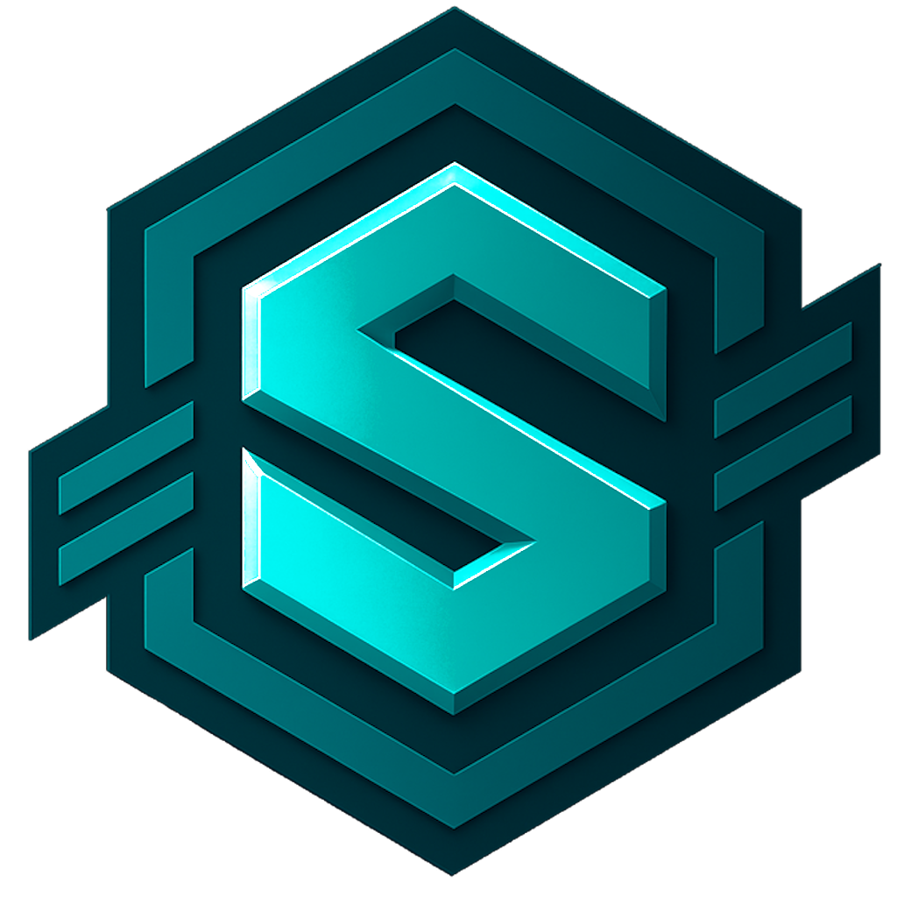
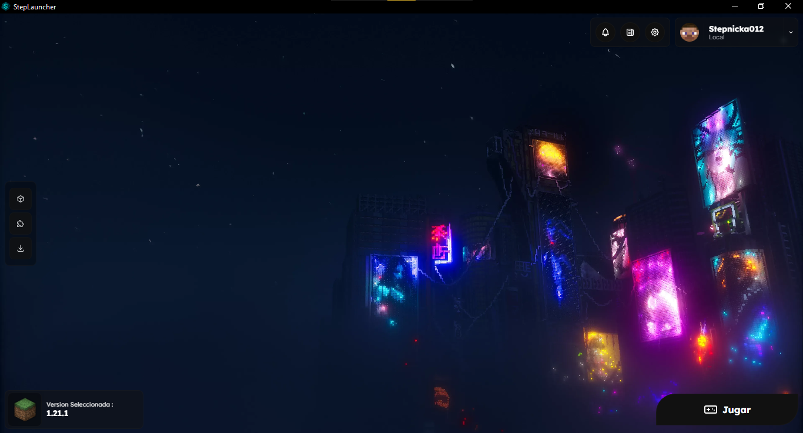
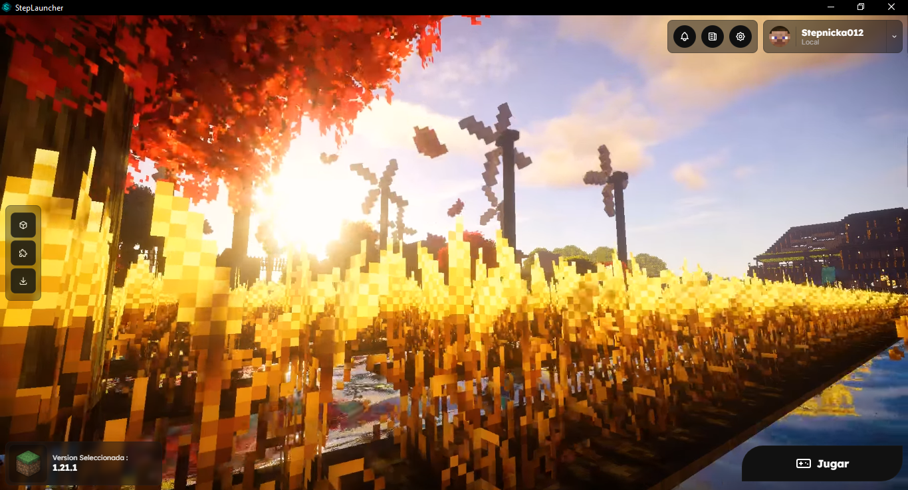
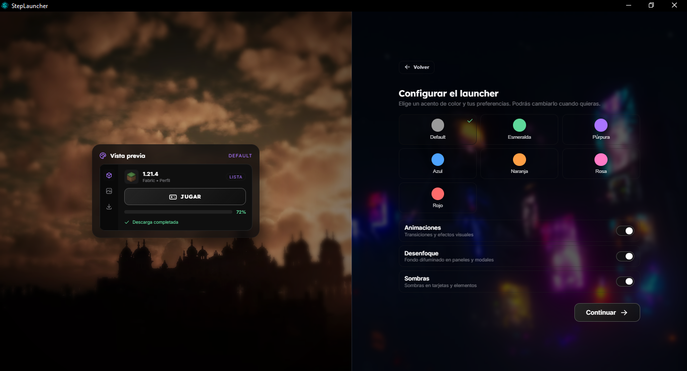
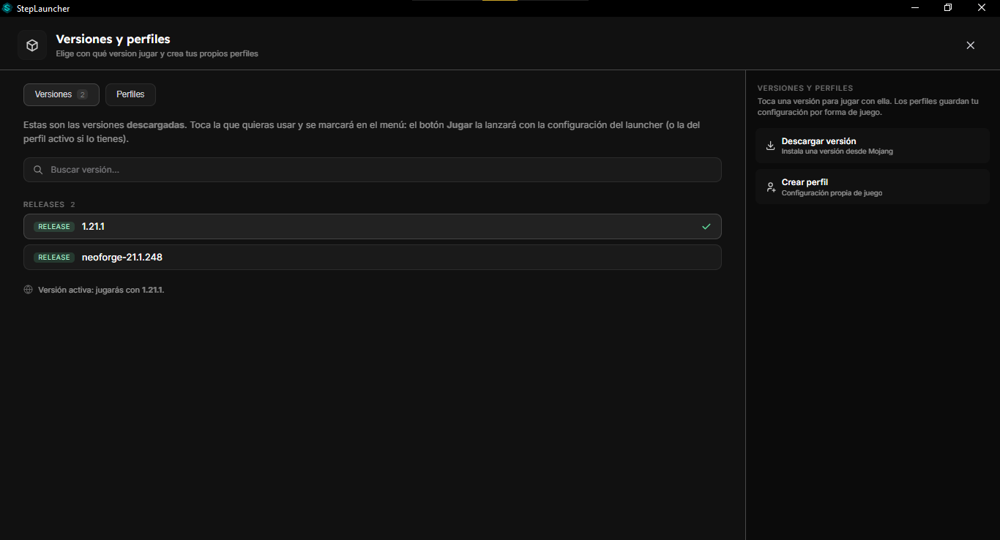
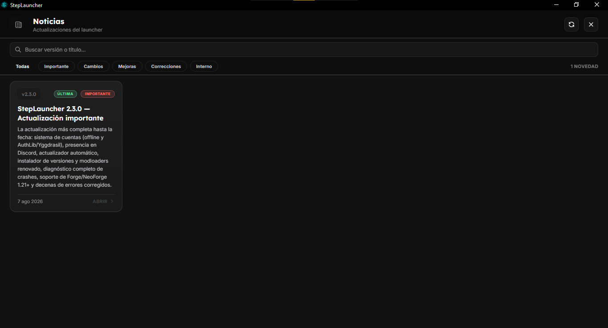
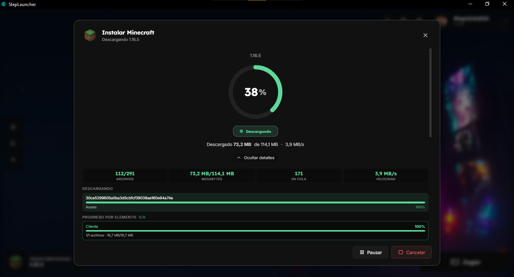
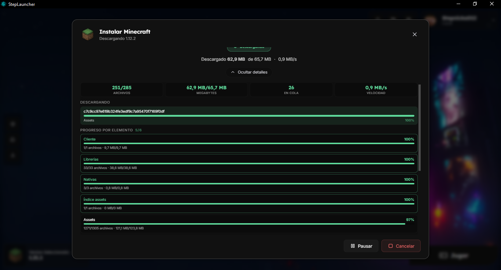
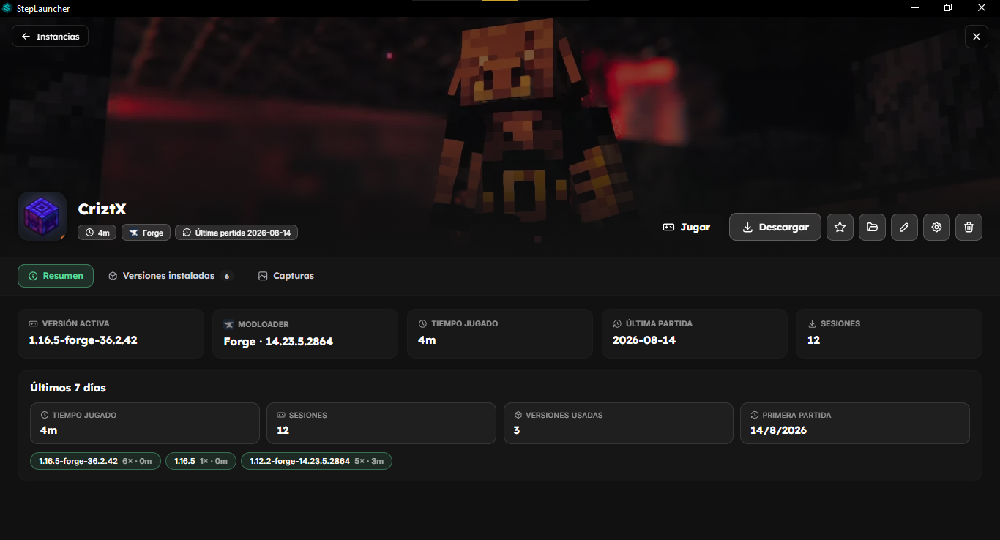

<div align="center">



# StepLauncher

**El launcher no premium para Minecraft: Java Edition, creado por NovaStepStudio**

Impulsado por **Wails v2** + **Go** + **Vue 3** &nbsp;·&nbsp; 

[](https://github.com/NovaStepStudio/StepLauncher/releases)
[](https://github.com/NovaStepStudio/StepLauncher/releases)
[](https://github.com/NovaStepStudio/StepLauncher/stargazers)
[](https://github.com/NovaStepStudio/StepLauncher/commits/main)
[](https://github.com/NovaStepStudio/StepLauncher/blob/main/LICENSE.md)

[](https://go.dev)
[](https://wails.io)
[](https://vuejs.org)
[](https://www.typescriptlang.org)
[](https://vitejs.dev)
[](https://bun.sh)
[](https://github.com/NovaStepStudio/StepLauncher/releases)

</div>

---

<div align="center">



*El menú principal de StepLauncher*

</div>

## 📖 Sobre

**StepLauncher** es un launcher de **Minecraft: Java Edition** no premium, desarrollado por **NovaStepStudio** y construido sobre **Wails v2** (Go + WebView2) con un frontend en **Vue 3 + TypeScript** altamente personalizable. Detrás de la interfaz funciona el motor del launcher (`internal/Handlers/Engine`), integrado en el programa: descargas, lanzamiento, modloaders, cuentas, caché, historial y actualizaciones con soporte multi-SO (Windows, Linux y macOS).

## ✨ Funcionalidades

### 🎮 Juego

- **Descarga de versiones**: gestor de descargas concurrente (1–16 hilos) con pausa, reanudación, cancelación, límite de velocidad, reintentos automáticos, detección de descargas estancadas y verificación **SHA1**.
- **Lanzamiento de Minecraft**: detección de Java (auto, sistema, oficial o custom), construcción de classpath/natives, argumentos JVM y del juego, proceso en segundo plano y **streaming de logs** con parseo en tiempo real.
- **Detección de crashes**: se captura el crash del juego y se guarda un historial con los logs del launcher, del juego y de la JVM, con su ruta para revisarlos o reportarlos.
- **Modloaders**: soporte para **Fabric, Quilt, LegacyFabric, Forge y NeoForge**, con resolución Maven, instaladores ejecutados por nivel de versión y detección del modloader instalado.
- **Instancias** (opcional): sistema de instancias con su propia versión, descargas compartidas, configuración propia, verificación y clonación, independiente del flujo principal.
- **Perfiles de lanzamiento**: varias configuraciones jugables con sus propios argumentos, memoria y ajustes.

### 👤 Cuentas y presencia

- **Cuentas offline y premium**: registro de cuentas con **Microsoft** (protocolo Yggdrasil) y servidores con **authlib-injector** (Mojang alternativo con un API personalizado), login y refresco automático de tokens y avatares (cabeza y cuerpo renderizados en el frontend).
- **Almacenamiento seguro**: tokens cifrados en disco (`launcher_accounts.json`) y nunca expuestos a la interfaz.
- **Discord Rich Presence**: estado de actividad en Discord con reconexión automática (navegando, lanzando, jugando).

### 🎨 Personalización

- **Fondos**: imagen, vídeo (MP4/WEBM, validados en resolución y duración) y fondos dinámicos con orden e intervalo.
- **Fuentes**: gestor de fuentes propio (importar, renombrar y eliminar) con sistema de slots (títulos/UI).
- **Colores**: toda la interfaz tematizable con historial reciente de colores (máximo 12) y variables CSS aplicadas en tiempo real.
- **UI**: zoom de interfaz entre 50% y 200%, animaciones, blur, sombras y textos con sombreado configurable.

### ⚙️ Configuración y sistema

- **Configuración avanzada**: RAM (auto/recomendada/manual con detección total del sistema), Java, resolución y pantalla completa, argumentos JVM y del juego, modo offline, proxy de Minecraft, autenticación y compatibilidad.
- **Hardware**: aceleración por hardware con tipo de GPU detectada, y preajustes de rendimiento.
- **Actualizaciones automáticas**: comprobación en el arranque contra GitHub Releases y, en Windows, descarga y ejecución del actualizador (`StepLauncher-Updater.exe`) que reemplaza el ejecutable.
- **Reposo y mantenimiento**: cierre automático de modales por inactividad, verificación periódica de la configuración y limpieza inteligente de la caché.
- **Caché**: manifiestos y JSON con TTL por categoría (manifest, version, assets, forge, java...), limpieza por categoría o entrada desde el frontend y reutilización de archivos descargados.
- **Nativo y ligero**: ventana WebView2 sin marcos de navegador; los datos persisten en `%APPDATA%\.StepLauncher` con logs a archivo rotados por día.

## 🚀 Novedades en la 2.3.1

- **Diálogo de bienvenida en el primer inicio**: onboarding con modelo 3D de jugador (Skin3D) y creación de la primera cuenta, además de un nuevo indicador de carga.
- **Lanzamiento corregido**: classpath/module path arreglado (vanilla y NeoForge/Forge moderno ya arrancan), deduplicación del classpath y RAM mínima fija de **512 MB**.
- **Soporte legacy de modloaders**: instaladores de Forge 1.8.9 y anteriores corregidos, con logs guardados y progreso en vivo (X/Y) durante la verificación.
- **Modal de crash rediseñado**: más datos de diagnóstico (Java, RAM máxima, versión base), organización en grilla y copiado del log.
- **Navegación por capas con ESC**, widgets flotantes independientes, botón Jugar con fases reales y opción de **lanzar Minecraft al terminar una instalación**.

Consulta el registro completo en [`Changelogs/`](Changelogs/).

## 🧱 Stack tecnológico

| Capa     | Tecnología                                                        |
|----------|-------------------------------------------------------------------|
| Backend  | Go 1.26.4, Wails v2.13.0 (bindings en `app.go` → `internal/`)     |
| Motor    | Integrado en el programa (`internal/Handlers/Engine` + `internal/Core`) |
| Frontend | Vue 3.5 (Composition API), TypeScript, Vite 8, SCSS               |
| Gestión  | bun (obligatorio para instalar/build) + `vue-tsc` type-check      |

## 📁 Estructura del repositorio

```
StepLauncher/
├── app.go                  # Bindings expuestos al frontend (delegan en internal/Handlers)
├── main.go                 # Punto de entrada (embed del frontend + Wails)
├── wails.json              # Configuración del proyecto Wails
├── AGENTS.md               # Guía maestra para Agentes de IA
├── .opencode/              # Instrucciones y directivas detalladas para IAs (ej. DeepSeek)
├── Changelogs/             # Registro oficial de errores, cambios y releases
├── resources/              # Capturas del launcher para el README
├── internal/
│   ├── Config/             # Configuración persistida (launcher_config.json)
│   ├── RichPresence/       # Discord Rich Presence por IPC local
│   ├── Handlers/           # Bindings + motor (Handlers/Engine)
│   └── Core/               # Motor: módulos del núcleo
│       ├── Accounts/       # Cuentas offline/premium + almacenamiento cifrado
│       ├── Auth/           # Yggdrasil (Microsoft) + authlib-injector
│       ├── Downloader/     # Descargas concurrentes, colas, verificación
│       ├── Launcher/       # Lanzador + perfil, historial, crashes e instancias
│       ├── ModLoader/      # Fabric, Quilt, LegacyFabric, Forge, NeoForge
│       ├── Cache/          # Caché con TTL por categoría
│       ├── Assets/         # Assets personalizables (launcher_assets.json)
│       ├── Logger/         # Logs a archivo rotado + broadcast al frontend
│       └── Utils/          # Maven, extracción, plataforma
└── frontend/
    ├── wailsjs/            # Bindings generados por Wails (no editar)
    └── web/                # Vue 3 + TS + SCSS + Vite
        ├── src/App.vue     # Ventana principal (splash, sidebar, tarjetas)
        ├── src/Common/     # Componentes, stores, composables y estilos transversales
        ├── src/Accounts/   # Dominio: cuentas (login, lista, avatares)
        ├── src/Downloads/  # Dominio: gestor de descargas y versiones
        ├── src/Instances/  # Dominio: instancias
        ├── src/Launcher/   # Dominio: lanzamiento y perfiles
        ├── src/Settings/   # Dominio: ajustes y personalización
        ├── src/Updates/    # Dominio: actualizaciones
        ├── src/Crash/      # Dominio: crash y reportes
        ├── src/Welcome/    # Dominio: onboarding y primer inicio
        ├── src/News/       # Dominio: noticias
        ├── src/Screenshots/ # Dominio: capturas de pantalla
        ├── src/Widgets/    # Widgets flotantes de la interfaz
        ├── src/Login/      # Login y autenticación
        └── src/Versions/   # Selector y detalle de versiones
```

> La arquitectura del frontend está organizada por **dominios** (feature-first): cada dominio contiene sus componentes, `Store.ts`, `Styles/` y composables propios. Lo transversal vive en `Common/`.

## 🚀 Desarrollo

### Requisitos

- **Go** 1.26.4
- **Wails CLI** (`go install github.com/wailsapp/wails/v2/cmd/wails@latest`)
- **bun** (obligatorio para el frontend)

### Comandos

```powershell
# Instalar dependencias del frontend
cd frontend
bun install
cd ..

# Dev en vivo (hot reload del frontend + bindings regenerados)
wails dev

# Verificación del backend
go build ./...

# Build de producción → build/bin/StepLauncher.exe
wails build
```

El build regenera los bindings `frontend/wailsjs`, ejecuta el type-check (`vue-tsc`) y embebe el frontend compilado en el binario final.

## 🤝 Contribución

- **Consulta los registros**: `Changelogs/` es la memoria oficial del proyecto; antes de diagnosticar o modificar nada, revisa lo que ya pasó.
- **Documenta todo**: cada error corregido o cambio relevante debe quedar registrado en `Changelogs/` ANTES de dar la tarea por terminada (convenciones en `Changelogs/README.md`).
- **Respeta la arquitectura**: bindings en `app.go`, delegación en `internal/Handlers`, sin bloquear el hilo principal ni los generadores de bindings de Wails, y sin self-deadlocks en `sync`.
- **Calidad primero**: no se saltan las verificaciones de build, el type-check, la revisión de mutex y canales ni las reglas de estilo (ver `AGENTS.md`).

Para las condiciones de **distribución y redistribución**, consulta el [Código de Conducta](CODE_OF_CONDUCT.md).

## 🤖 Uso de inteligencia artificial

StepLauncher utiliza herramientas de inteligencia artificial como parte del proceso de desarrollo. Se emplean principalmente para análisis de código, auditoría, debugging, revisión de arquitectura y asistencia durante la implementación.

La IA no reemplaza al creador del proyecto ni toma las decisiones finales sobre su arquitectura o funcionamiento. Todo cambio asistido por IA debe ser revisado, probado y validado antes de considerarse parte del proyecto.

El desarrollo, la dirección técnica y la responsabilidad final sobre StepLauncher corresponden al creador del proyecto.

## 📄 Licencia

Este proyecto se distribuye bajo la **GNU General Public License v3.0**. Consulta [`LICENSE.md`](LICENSE.md) para más detalles.

## 📷 Galería de capturas

| | |
|---|---|
|  |  |
|  |  |
|  |  |
|  |  |
|  |  |
|  |  |

---

<div align="center">

**NovaStepStudio** — Santiago Stepnicka

[GitHub](https://github.com/NovaStepStudio) · [Repositorio](https://github.com/NovaStepStudio/StepLauncher) · [Docs](https://novastepstudios.pages.dev) · [Discord](https://discord.gg/stepnicka012) · [Wails](https://wails.io)

<sub>© 2026 NovaStepStudio — StepLauncher es un proyecto independiente y no está afiliado a Mojang Studios ni a Microsoft.</sub>

</div>
