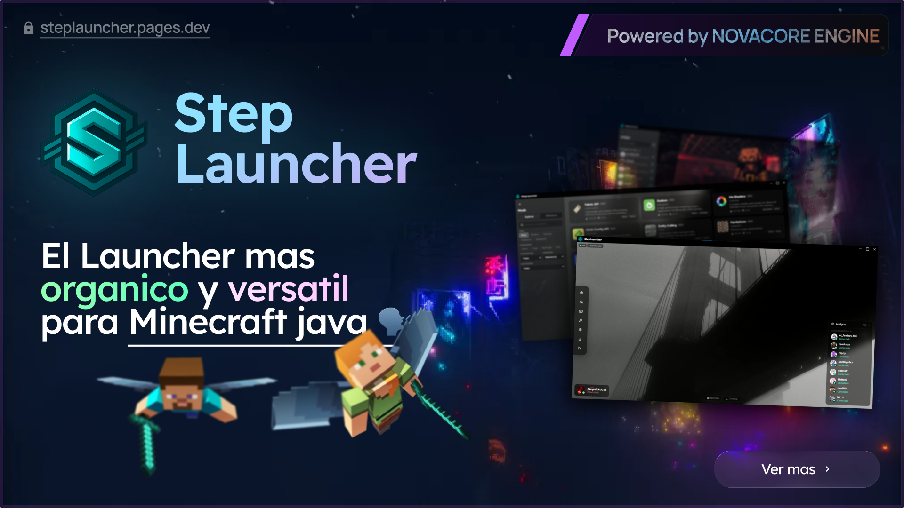
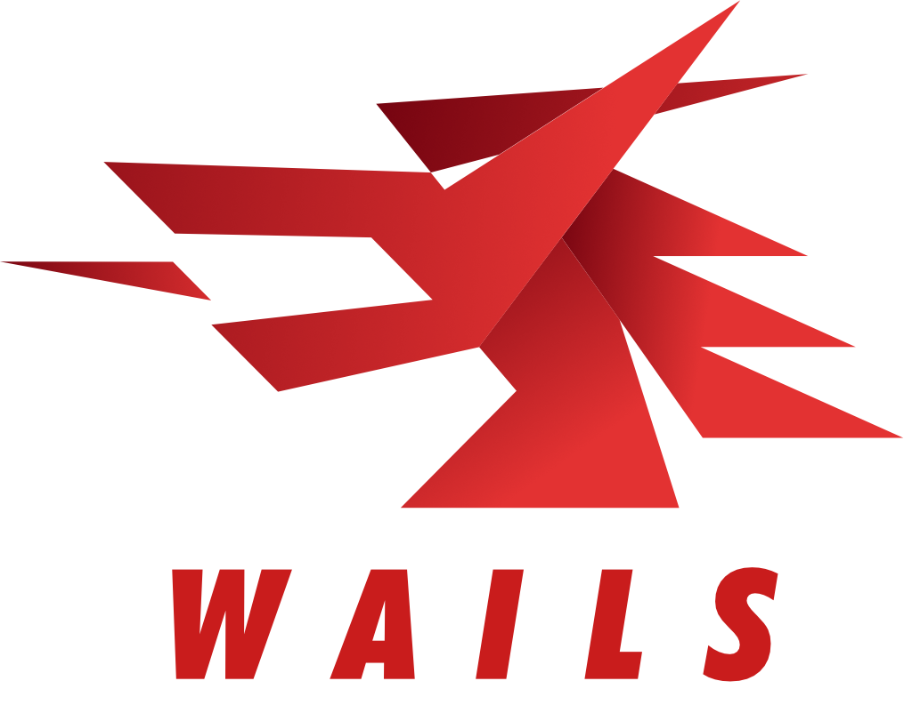
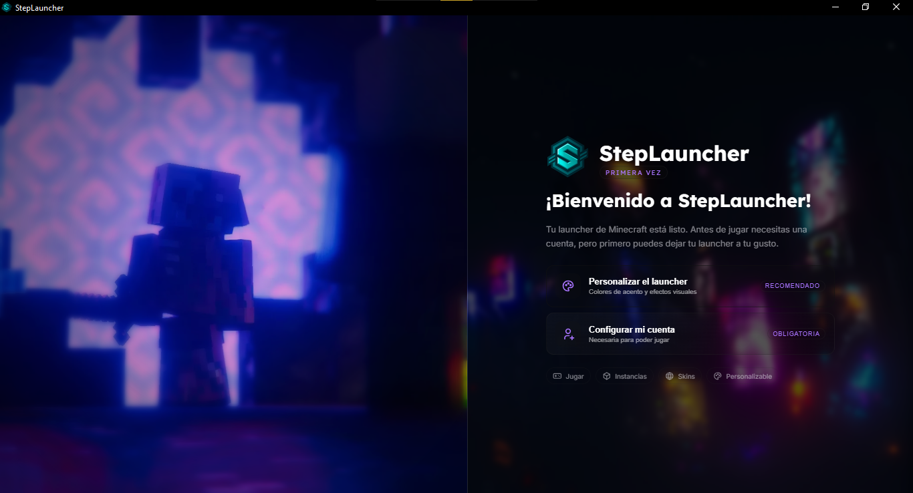
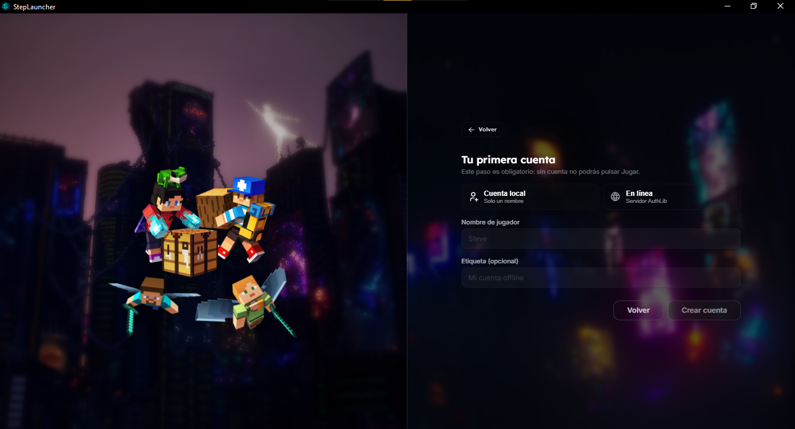
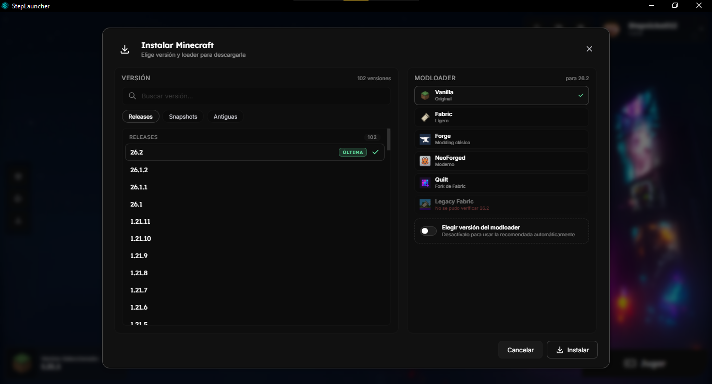
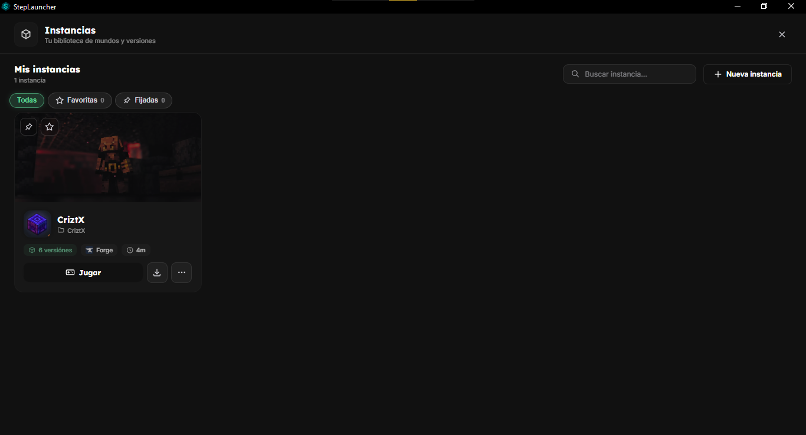
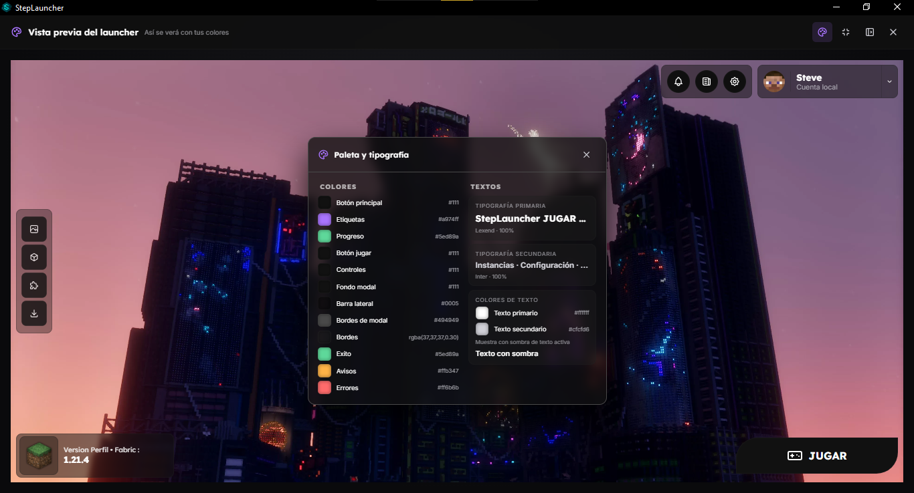

<div align="center">

<a href="https://steplauncher.pages.dev">
  
</a>


# StepLauncher

**Monorepo oficial de StepLauncher — launcher no premium para Minecraft: Java Edition, creado por NovaStepStudio**

Impulsado por **Wails v3** + **Go** + **Vue 3** &nbsp;·&nbsp; 

> 🌐 **Visita nuestra página principal:** [**steplauncher.pages.dev**](https://steplauncher.pages.dev) — descubre el proyecto, la documentación y descarga la última beta. &nbsp;·&nbsp; Powered by **NovaCore Engine**

[](https://github.com/NovaStepStudio/StepLauncher/releases)
[](https://github.com/NovaStepStudio/StepLauncher/releases)
[](https://github.com/NovaStepStudio/StepLauncher/stargazers)
[](https://github.com/NovaStepStudio/StepLauncher/commits/main)
[](https://github.com/NovaStepStudio/StepLauncher/blob/main/LICENSE.md)

[](https://go.dev)
[](https://wails.io)
[](https://vuejs.org)
[](https://www.typescriptlang.org)
[](https://vitejs.dev)
[](https://bun.sh)
[](https://github.com/NovaStepStudio/StepLauncher/releases)

</div>

---

## 📖 Sobre este repositorio

**StepLauncher ya es un monorepo**: contiene varios subproyectos independientes que se desarrollan, verifican y despliegan **por separado**. Un cambio en la web **no** tiene que modificar el launcher, y un cambio en el launcher **no** tiene que tocar la web.

| Subproyecto | Qué es | Documentación propia |
|---|---|---|
| [`launcher/`](launcher/) | App de escritorio (Wails v3 + Go + Vue 3): descargas, lanzamiento, modloaders, instancias, cuentas, música, personalización | [`launcher/README.md`](launcher/README.md) · [`launcher/AGENTS.md`](launcher/AGENTS.md) |
| [`website/`](website/) | Web pública e informativa (Vue 3 + TS + Vite, despliegue en Cloudflare Pages): presentación, descargas, changelog, privacidad y términos | [`website/AGENTS.md`](website/AGENTS.md) |
| [`api/`](api/) | Backend/API (Cloudflare Workers + Hono + Supabase): cuentas del jugador. Código aún no publicado en este repo | — |
| [`.github/`](.github/) | CI, releases, plantillas de issues/PR y configuración del repositorio | — |


<div align="center">


*Menú principal de StepLauncher (app de escritorio)*

</div>

## 🌐 Página principal

> La web oficial vive en **[steplauncher.pages.dev](https://steplauncher.pages.dev)** y su código vive en [`website/`](website/). Allí encontrarás la presentación del launcher, características destacadas, la [Política de Privacidad](https://steplauncher.pages.dev/PrivacyPolicy) y los [Términos y Condiciones](https://steplauncher.pages.dev/TermsAndConditions), además de enlaces a Discord, GitHub y descarga.

<a href="https://steplauncher.pages.dev">
  
</a>

## ✨ Qué hace cada parte (resumen)

### 🖥️ `launcher/` — app de escritorio
- Descarga concurrente de versiones con SHA1, pausa y reanudación.
- Lanzamiento con detección de Java, modloaders (Fabric, Quilt, Forge, NeoForge…), instancias y cuentas offline/premium.
- Biblioteca de música local, personalización (fondos, fuentes, colores, zoom) y Discord Rich Presence.
- Beta actual: **2.5.0-beta** — historial en [`launcher/Changelogs/`](launcher/Changelogs/).

### 🌍 `website/` — web pública
- Landing, descargas, changelog público, privacidad y términos.
- Vue 3 + Vite + Vue Router, desplegada como sitio estático en Cloudflare Pages (`bun run deploy`).

### 🧩 `api/` — backend
- API a medida (Cloudflare Workers + Hono, datos y Auth en Supabase) centrada en la cuenta del jugador.
- Código aún no publicado en este repo: cuando se suba, traerá su propio `README.md` y `AGENTS.md`.

## 📁 Estructura del monorepo

```
StepLauncher/
├── launcher/            # ← app de escritorio (su propio go.mod, frontend, build, Changelogs)
│   ├── main.go / go.mod / Taskfile.yml
│   ├── internal/        # backend Go (Config, Core, Services, Music, Updater…)
│   ├── frontend/        # frontend Vue del launcher (web/src por dominios + bindings)
│   ├── resources/       # banners y capturas del launcher
│   ├── build/           # config Wails por plataforma (windows, darwin, linux, android)
│   ├── bin/             # binarios generados
│   ├── Changelogs/      # memoria histórica SOLO del launcher
│   ├── AGENTS.md        # reglas IA del launcher
│   └── README.md        # detalle completo del launcher
├── website/             # ← web pública (su propio package.json, vite, wrangler)
│   ├── web/src/         # Home, Download, Changelog, About, Common…
│   ├── vite.config.ts / wrangler.jsonc
│   ├── dist/            # build generado (no se edita a mano)
│   └── AGENTS.md        # reglas IA de la web
├── api/                 # ← backend (se publica por separado, aún no en el repo)
├── .github/             # workflows, plantillas, releases
├── AGENTS.md            # ← este archivo: enrutador del monorepo para IAs
├── README.md            # ← estás aquí: índice del monorepo
├── LICENSE.md / CODE_OF_CONDUCT.md / .gitignore
```

> No hay `go.mod` ni `package.json` en la raíz: **cada subproyecto compila dentro de su propia carpeta**.

## 🚀 Desarrollo (por subproyecto, aislado)

**Launcher (app de escritorio):**
```powershell
cd launcher
go build ./...                    # verificación backend
cd frontend; bun install; cd ..
cd frontend; bun run build; cd .. # type-check + build frontend (bun obligatorio, prohibido npm)
wails3 dev                        # modo desarrollo
wails3 build                      # binario en bin/
```

**Website (página pública):**
```powershell
cd website
bun install                       # bun obligatorio, prohibido npm
bun run build                     # type-check + build Vite (verificación obligatoria)
bun run dev                       # desarrollo local
bun run deploy                    # build + despliegue a Cloudflare Pages
```

**API:**
```powershell
# api/ aún no vive en este repo: cuando se publique, ver su README propio.
```

## 📷 Galería (launcher)

| | | |
|---|---|---|
|  |  |  |
|  |  |  |
|  |  |  |

Galería completa del panel de música en [`launcher/README.md`](launcher/README.md).

---

<div align="center">

**NovaStepStudio** — Santiago Stepnicka

[🌐 Página principal](https://steplauncher.pages.dev) · [Política de Privacidad](https://steplauncher.pages.dev/PrivacyPolicy) · [Términos](https://steplauncher.pages.dev/TermsAndConditions) · [GitHub](https://github.com/NovaStepStudio) · [Repositorio](https://github.com/NovaStepStudio/StepLauncher) · [Wails](https://wails.io)

<sub>© 2026 NovaStepStudio — Powered by NovaCore Engine · No afiliado a Mojang Studios ni a Microsoft.</sub>

</div>
