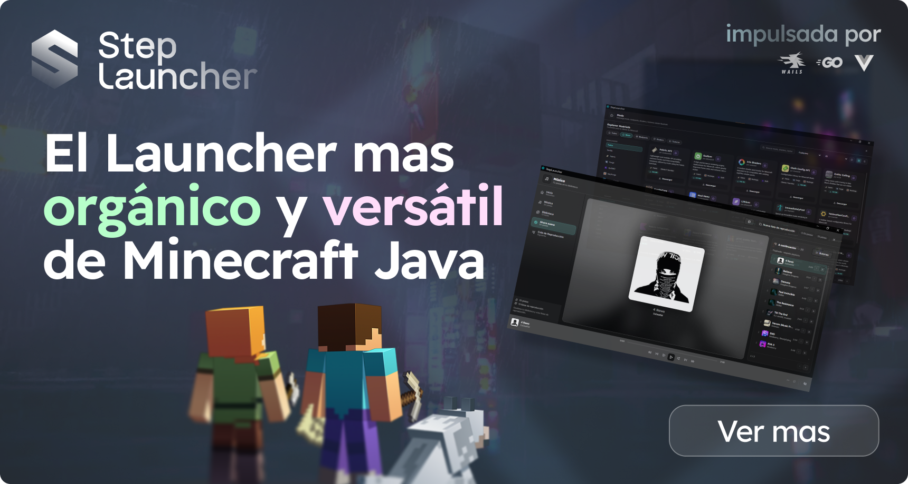
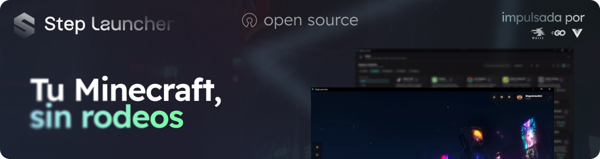
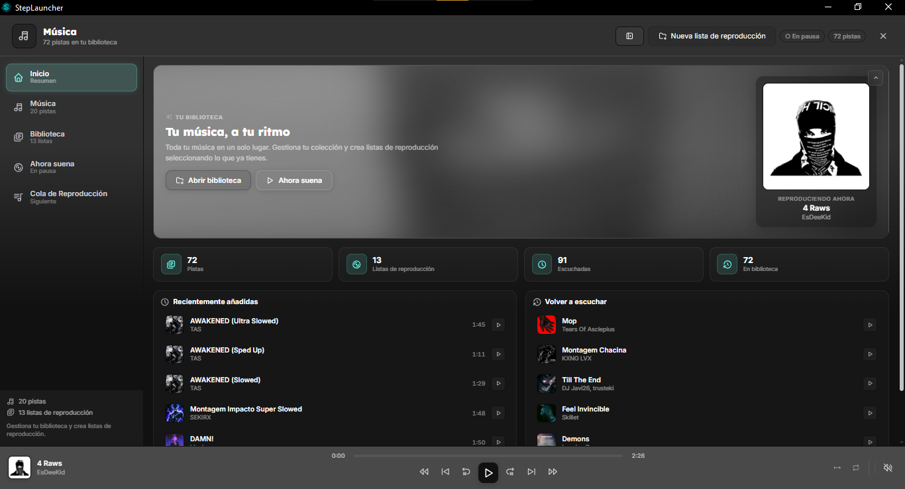
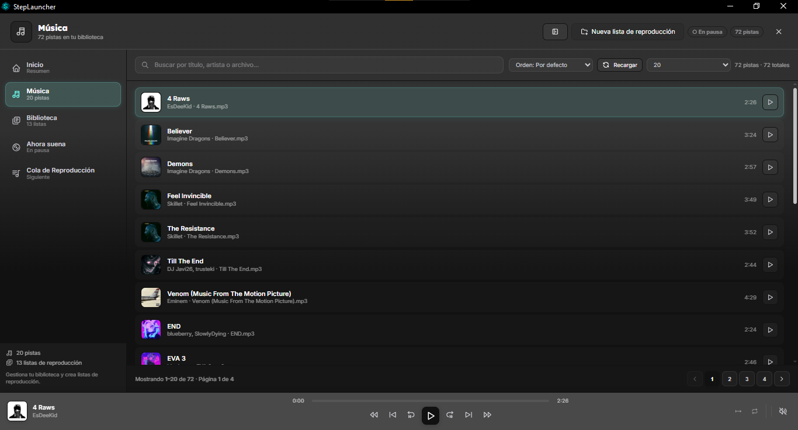
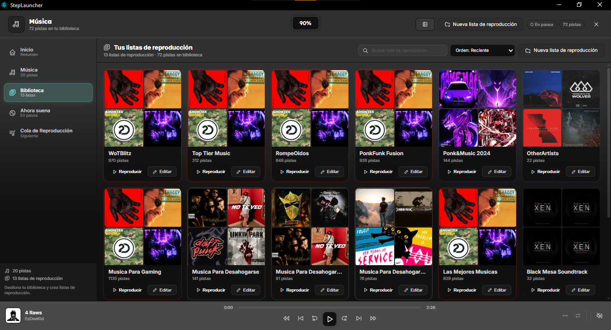
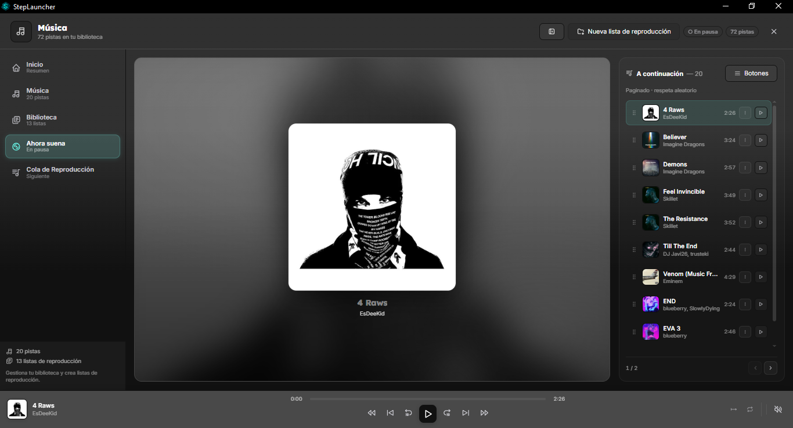
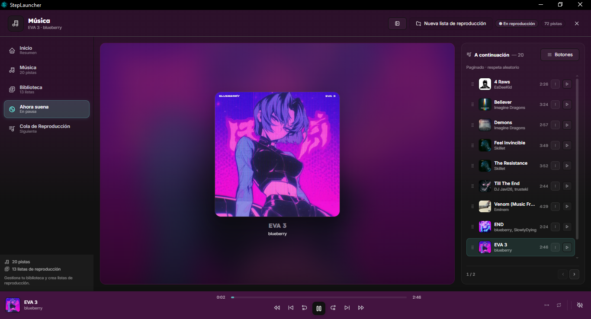
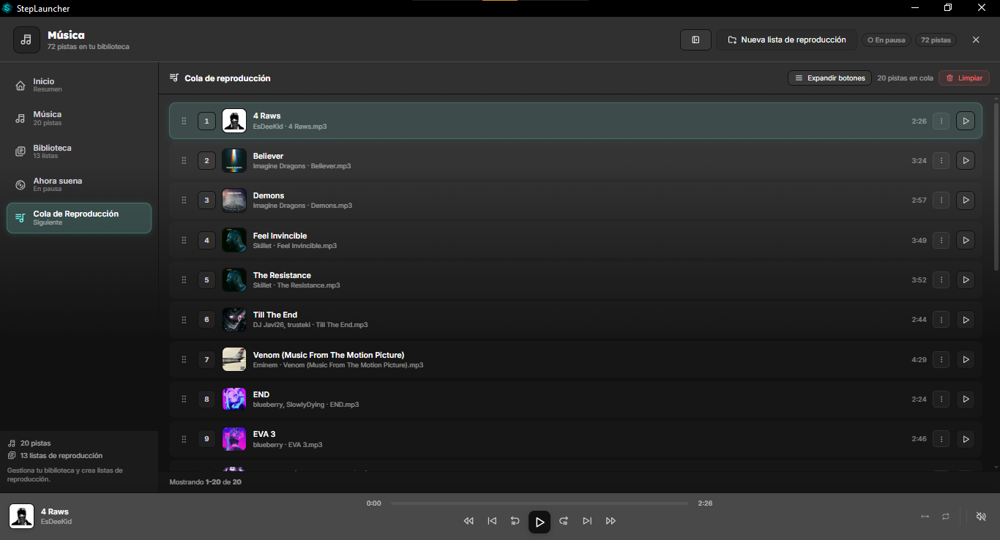

<div align="center">

<a href="https://steplauncher.pages.dev">
  
</a>


# StepLauncher

**El launcher no premium para Minecraft: Java Edition, creado por NovaStepStudio**

Impulsado por **Wails v3** + **Go** + **Vue 3** &nbsp;·&nbsp; 

> 🌐 **Visita nuestra página principal:** [**steplauncher.pages.dev**](https://steplauncher.pages.dev) — descubre el proyecto, la documentación y descarga la última beta. &nbsp;·&nbsp; Powered by **NovaCore Engine**

[](https://github.com/NovaStepStudio/StepLauncher/releases)
[](https://github.com/NovaStepStudio/StepLauncher/releases)
[](https://github.com/NovaStepStudio/StepLauncher/stargazers)
[](https://github.com/NovaStepStudio/StepLauncher/commits/main)
[](https://github.com/NovaStepStudio/StepLauncher/blob/main/LICENSE.md)

[](https://go.dev)
[](https://wails.io)
[](https://vuejs.org)
[](https://www.typescriptlang.org)
[](https://vitejs.dev)
[](https://bun.sh)
[](https://github.com/NovaStepStudio/StepLauncher/releases)

</div>

---

<div align="center">


*Menú principal de StepLauncher*

</div>

## 🌐 Página principal

> **¿Quieres conocer mejor el proyecto?** Visita nuestra web oficial en **[steplauncher.pages.dev](https://steplauncher.pages.dev)** — allí encontrarás la presentación del launcher, características destacadas, la [Política de Privacidad](https://steplauncher.pages.dev/PrivacyPolicy) y los [Términos y Condiciones](https://steplauncher.pages.dev/TermsAndConditions) actualizados (19 de mayo de 2026), además de enlaces a Discord, GitHub y descarga.

<a href="https://steplauncher.pages.dev">
  
</a>

## 📖 Sobre

**StepLauncher** es un launcher de **Minecraft: Java Edition** no premium, desarrollado por **NovaStepStudio** y construido sobre **Wails v3** (Go + WebView2) con un frontend en **Vue 3 + TypeScript** altamente personalizable. Integra descargas, lanzamiento, modloaders, cuentas, historial, actualizaciones y biblioteca musical en una sola aplicación nativa y ligera para Windows, Linux y macOS.

Beta actual: **2.5.0-beta** — ver [`Changelogs/Beta/StepLauncher-2.5.0/`](Changelogs/Beta/StepLauncher-2.5.0/). Historial completo en [`Changelogs/`](Changelogs/).

## ✨ Funcionalidades

### 🎮 Juego
- **Descarga de versiones** concurrente (1–16 hilos) con pausa, reanudación, límite de velocidad, reintentos y verificación **SHA1**.
- **Lanzamiento** con detección de Java (auto/sistema/oficial/custom), classpath/natives, argumentos JVM/juego y streaming de logs en tiempo real.
- **Modloaders** Fabric, Quilt, LegacyFabric, Forge y NeoForge con resolución Maven y detección del instalado.
- **Instancias** con versión propia, configuración, verificación y clonación; descargas compartidas en `shared`.

### 👤 Cuentas y presencia
- **Cuentas offline y premium** (Microsoft / authlib-injector), refresco de tokens y avatares renderizados en el frontend.
- **Discord Rich Presence** con reconexión automática.

### 🎨 Personalización
- **Fondos** imagen, vídeo y dinámicos; galería con dedup por URL.
- **Fuentes** con slots (títulos/UI), **colores** tematizables y **UI** con zoom 50%–200%, blur y sombras.

## 🎵 Panel de música

El panel de música es una **biblioteca local real**, no un reproductor de fondo limitado. Escanea tu carpeta de música (mp3/wav/ogg/m4a/flac, hasta 2000 pistas) y crea un índice persistente `cache/music/index_v2.gob.gz` (~1 MB para 5000 pistas) con escaneo incremental.

**Estructura del panel:**
- **Inicio** — resumen con carátula en alta resolución, paleta extraída de la cover y estadísticas (pistas, listas, cola).
- **Música** — lista paginada (20/50/100) con búsqueda, carátulas y paginación.
- **Biblioteca** — playlists con grid 2×2 de carátulas, edición y `TrackSelector` visual para añadir pistas sin escribir rutas.
- **Ahora suena** — carátula enorme, progreso y cola lateral paginada.
- **Cola de Reproducción** — lista numerada con reorden y limpieza.

**Reproductor (`PlayerBar`):** `HTMLAudioElement` con `Blob URLs` (LRU 6), 7 controles (prev/prev-prev/-10s/play-pause/+10s/next/next-next), modos aleatorio/bucle y volumen con popup que ya no colisiona con la lista. Widget dual **Fondo/Biblioteca** con mini cola.

<div align="center">

| Inicio | Explorar |
|---|---|
|  |  |

| Biblioteca | Ahora suena |
|---|---|
|  |  |

| Ahora suena (variante) | Cola de reproducción |
|---|---|
|  |  |

</div>

## 🧱 Stack tecnológico

| Capa | Tecnología |
|------|------------|
| Backend | Go 1.26.4, Wails v3.0.0-beta.9 (9 servicios en `internal/Services/`) |
| Motor | `internal/Handlers/Engine` + `internal/Core` + `internal/Music` (`index_v2`) |
| Frontend | Vue 3.5, TypeScript, Vite 8, SCSS |
| Gestión | bun + `vue-tsc` |

### 📊 Estadísticas del proyecto (SCC)

```
───────────────────────────────────────────────────────────────────────────────
Language            Files       Lines    Blanks  Comments       Code Complexity
───────────────────────────────────────────────────────────────────────────────
Go                    129      28,059     2,723       907     24,429      6,979
Markdown              126       9,351     2,446         0      6,905          0
TypeScript            105      10,571     1,186       847      8,538      1,758
Sass                   59      23,354     2,806       136     20,412          0
Vue                    54      19,007     1,624       247     17,136      1,686
JSON                   16         400         1         0        399          0
YAML                    7       1,376       134       139      1,103          0
Shell                   5          59        11        19         29          4
TypeScript Typ…         2          43         1         6         36          0
XML                     2         109        12         0         97          0
HTML                    1         114        13         0        101          0
Powershell              1         128         3         5        120          9
SVG                     1           9         0         0          9          0
───────────────────────────────────────────────────────────────────────────────
Total                 508      92,580    10,960     2,306     79,314     10,436
───────────────────────────────────────────────────────────────────────────────
```

## 📁 Estructura del proyecto

> Árbol **completo de carpetas** (162 directorios) generado con `python` ignorando `node_modules`, `dist`, `bin`, `.git`, `cache` y `.task`. Solo se omiten archivos para no saturar; todas las carpetas reales están listadas.

```
StepLauncher/
├── main.go / go.mod / go.sum / Taskfile.yml
├── AGENTS.md / CODE_OF_CONDUCT.md / LICENSE.md / README.md / .gitignore / .npmrc
├── frontend/
│   ├── bindings/
│   │   ├── StepLauncher/
│   │   │   └── internal/
│   │   │       ├── Config/
│   │   │       ├── Core/
│   │   │       │   ├── Accounts/
│   │   │       │   ├── Assets/
│   │   │       │   ├── Cache/
│   │   │       │   ├── Downloader/
│   │   │       │   ├── Launcher/
│   │   │       │   └── ModLoader/
│   │   │       ├── Handlers/
│   │   │       │   └── Engine/
│   │   │       ├── Music/
│   │   │       │   ├── MusicHistory/
│   │   │       │   ├── NowPlaying/
│   │   │       │   └── Playlist/
│   │   │       └── Services/
│   │   │           ├── Account/
│   │   │           ├── Appearance/
│   │   │           ├── Config/
│   │   │           ├── Download/
│   │   │           ├── Game/
│   │   │           ├── Instance/
│   │   │           ├── ModLoader/
│   │   │           ├── Music/
│   │   │           └── System/
│   │   └── github.com/
│   │       └── wailsapp/
│   │           └── wails/
│   │               └── v3/
│   └── web/
│       ├── assets/
│       │   ├── background/
│       │   ├── decorations/
│       │   ├── fonts/
│       │   ├── gif/
│       │   ├── icons/
│       │   └── not_found/
│       ├── public/
│       │   └── wails/
│       └── src/
│           ├── Accounts/
│           │   └── Styles/
│           ├── Common/
│           │   ├── Bootstrap/
│           │   │   ├── Styles/
│           │   │   └── tasks/
│           │   ├── Components/
│           │   ├── Composables/
│           │   │   └── SkinPlayer/
│           │   ├── Overlays/
│           │   ├── Stores/
│           │   ├── Styles/
│           │   │   ├── App/
│           │   │   ├── Components/
│           │   │   └── base/
│           │   └── Widgets/
│           │       └── Styles/
│           ├── Crash/
│           │   └── Styles/
│           ├── Downloads/
│           │   └── Styles/
│           ├── Instances/
│           │   └── Styles/
│           ├── Launcher/
│           ├── Login/
│           │   └── Styles/
│           ├── Mods/
│           │   └── Styles/
│           ├── Music/
│           │   ├── Components/
│           │   └── Styles/
│           ├── News/
│           │   └── Styles/
│           ├── Screenshots/
│           │   └── Styles/
│           ├── Settings/
│           │   ├── Sections/
│           │   └── Styles/
│           ├── Updates/
│           │   └── Styles/
│           ├── Versions/
│           │   └── Styles/
│           └── Welcome/
│               └── Styles/
├── internal/
│   ├── Config/
│   ├── Core/
│   │   ├── Accounts/
│   │   ├── Assets/
│   │   ├── Auth/
│   │   ├── Cache/
│   │   ├── Downloader/
│   │   │   └── Utils/
│   │   ├── Launcher/
│   │   │   ├── Helpers/
│   │   │   ├── History/
│   │   │   ├── Instance/
│   │   │   ├── Log/
│   │   │   ├── Profile/
│   │   │   └── Utils/
│   │   ├── Logger/
│   │   ├── ModLoader/
│   │   │   ├── Installer/
│   │   │   └── Provider/
│   │   ├── News/
│   │   ├── Platform/
│   │   └── Utils/
│   ├── Handlers/
│   │   └── Engine/
│   │       └── engineconfig/
│   ├── Music/
│   │   ├── MusicHistory/
│   │   ├── NowPlaying/
│   │   └── Playlist/
│   ├── RichPresence/
│   ├── Services/
│   │   ├── Account/
│   │   ├── Appearance/
│   │   ├── Config/
│   │   ├── Download/
│   │   ├── Game/
│   │   ├── Instance/
│   │   ├── ModLoader/
│   │   ├── Music/
│   │   └── System/
│   ├── Tray/
│   └── Updater/
└── resources/
```

> Frontend por **dominios** (feature-first): cada dominio con su `Store.ts`, `Styles/` y composables. Lo transversal en `Common/`.

## 🚀 Desarrollo

```powershell
cd frontend; bun install; cd ..
wails3 dev          # dev start
go vet ./...        # verificación
wails3 build        # build/bin/StepLauncher.exe
```

## 📷 Galería

| | | |
|---|---|---|
|  |  |  |
|  |  |  |
|  |  |  |

---

<div align="center">

**NovaStepStudio** — Santiago Stepnicka

[🌐 Página principal](https://steplauncher.pages.dev) · [Política de Privacidad](https://steplauncher.pages.dev/PrivacyPolicy) · [Términos](https://steplauncher.pages.dev/TermsAndConditions) · [GitHub](https://github.com/NovaStepStudio) · [Repositorio](https://github.com/NovaStepStudio/StepLauncher) · [Wails](https://wails.io)

<sub>© 2026 NovaStepStudio — Powered by NovaCore Engine · No afiliado a Mojang Studios ni a Microsoft.</sub>

</div>
